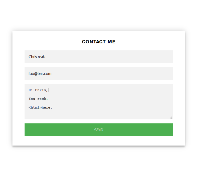
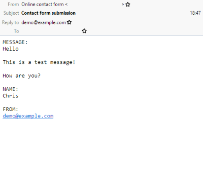

= Go contact form

== About

Provides a simple, tiny webservice that serves a contact form and sends responses
via e-mail.

 ->

== Usage

The simplest way to use this is via docker:

    docker run -d csmith/contact-form -from form@server.com -to me@email.com .....

You should place this service behind an TLS-terminating proxy, and ensure it
is requested over a secure connection.

== Parameters

The application can be configured either using command line arguments
or environmental variables (shown in square brackets, below).
_from_, _to_, _smtp-host_, _smtp-user_, and _smtp-pass_ are required;
other options have vaguely sensible fallbacks.

----
  -crsf-key string
    	CRSF key to use [CONTACT_CRSF_KEY]
  -from string
    	address to send e-mail from [CONTACT_FROM]
  -port int
    	port to listen on for connections [CONTACT_PORT] (default 8080)
  -smtp-host string
    	SMTP server to connect to [CONTACT_SMTP_HOST]
  -smtp-pass string
    	password to supply to the SMTP server [CONTACT_SMTP_PASS]
  -smtp-port int
    	port to use when connecting to the SMTP server [CONTACT_SMTP_PORT] (default 25)
  -smtp-user string
    	username to supply to the SMTP server [CONTACT_SMTP_USER]
  -subject string
    	e-mail subject [CONTACT_SUBJECT] (default "Contact form submission")
  -to string
    	address to send e-mail to [CONTACT_TO]
----

You can use any SMTP server; however I recommend using a dedicated service
such as https://www.mailgun.com/[mailgun] or
https://aws.amazon.com/ses/[AWS SES], both of which you can access over SMTP.

== Templates

The form itself is loaded from `form.html` in the working directory; success and failure pages from `success.html`
and `failure.html` respectively. Each is loaded as a https://golang.org/pkg/html/template/[go html.template] and
can use the templating syntax described there. The form must contain the `{{ .csrfField }}` template field, which
will automatically insert the CSRF token for the request.

If the form contains a field named `from`, it will be used in the `Reply-To` header. Otherwise, no
special processing is applied to any field; they are all simply written out to the message body.
No server-side validation is performed.

When running from the docker image, templates are stored in `/templates`; you can
replace this with a volume to supply custom templates.

== Credits

Developed by https://chameth.com[Chris Smith]; CSS heavily based on the login form in
 https://github.com/greboid/ig[ig] by https://greboid.com[Greg Holmes].

== Licence

This software is licensed under the MIT licence. See the LICENCE.adoc file for the full text.
